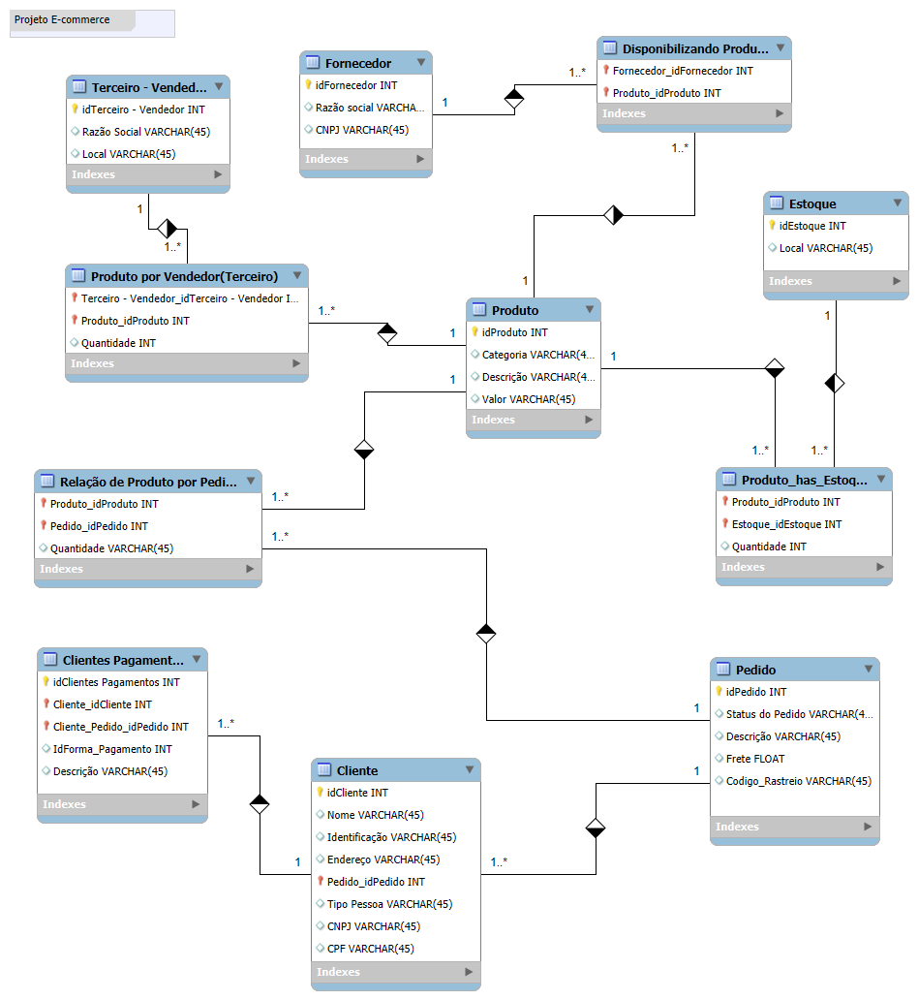

# 📦 Projeto E-commerce - Modelo de Banco de Dados

Este projeto apresenta um **modelo de banco de dados relacional** desenvolvido para um sistema de e-commerce. Ele organiza as informações relacionadas a fornecedores, produtos, pedidos, clientes, estoques e pagamentos.

## 📊 Estrutura do Banco de Dados

O banco de dados está dividido em diversas tabelas inter-relacionadas. Abaixo segue o resumo das entidades e seus principais atributos:

### **Entidades Principais**

1. **Terceiro - Vendedor**  
   - Atributos: `idTerceiro - Vendedor`, `Razão Social`, `Local`.

2. **Fornecedor**  
   - Atributos: `idFornecedor`, `Razão Social`, `CNPJ`.

3. **Produto**  
   - Atributos: `idProduto`, `Categoria`, `Descrição`, `Valor`.

4. **Estoque**  
   - Atributos: `idEstoque`, `Local`.

5. **Pedido**  
   - Atributos: `idPedido`, `Status do Pedido`, `Descrição`, `Frete`, `Codigo_Rastreio`.

6. **Cliente**  
   - Atributos: `idCliente`, `Nome`, `Identificação`, `Endereço`, `Tipo Pessoa`, `CNPJ`, `CPF`.

7. **Clientes Pagamentos**  
   - Atributos: `idClientes Pagamentos`, `Cliente_idCliente`, `Cliente_Pedido_idPedido`, `IdForma_Pagamento`, `Descrição`.

---

### **Relacionamentos**

- **Produto** é vinculado a **Fornecedor** através da tabela `Disponibilizando Produto`.
- **Produto** é associado ao **Estoque** pela tabela `Produto_has_Estoque`.
- **Produto** também está relacionado a pedidos pela tabela `Relação de Produto por Pedido`.
- **Pedidos** estão vinculados a **Clientes**.
- **Clientes Pagamentos** gerencia os pagamentos dos clientes para os pedidos.
- A tabela **Produto por Vendedor (Terceiro)** organiza a quantidade de produtos fornecidos por vendedores terceirizados.

---

### **Modelo Visual**

O diagrama abaixo demonstra visualmente as entidades, atributos e os relacionamentos existentes entre as tabelas.

---

## ⚙️ Tecnologias Utilizadas

- **MySQL**: Para modelagem e implementação do banco de dados.
- **Workbench**: Utilizado para o design do diagrama relacional.

---

## 🚀 Próximos Passos

- Implementar o banco de dados no servidor SQL.
- Testar os relacionamentos entre as tabelas com dados simulados.
- Desenvolver a integração com uma aplicação web ou API.

---

## 🤝 Contribuição

Contribuições são bem-vindas!  
Se tiver sugestões ou melhorias, fique à vontade para abrir um *Pull Request*.

---

### 📧 Contato  
Caso tenha dúvidas ou sugestões, entre em contato comigo!

---
